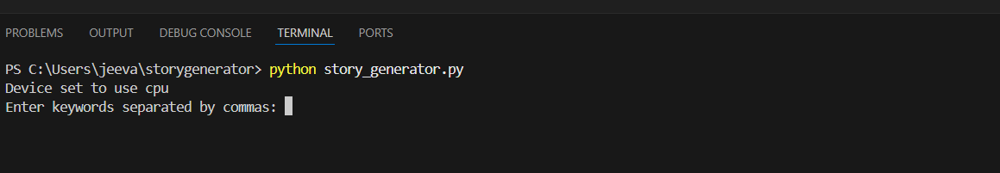
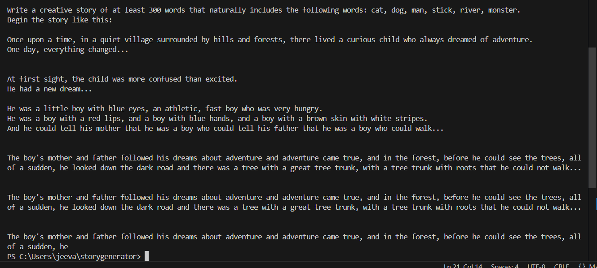

# 📖 Story Generator AI

Generate creative short stories from a single word using Python.

---

## 📸 Screenshots

### ▶ User Input in Terminal



### 📘 Generated Story Output



---

## 🚀 Features

- 📝 Generates a full story from a single word
- 💡 Great for Python beginners
- 🤖 Pure Python terminal-based app
- 🎯 Simple, creative, and fun!

---

## 🧪 How to Run

1. *Clone the repository*
   ```bash
   git clone https://github.com/Jeevankalla977/story_generator.git
   cd story_generator